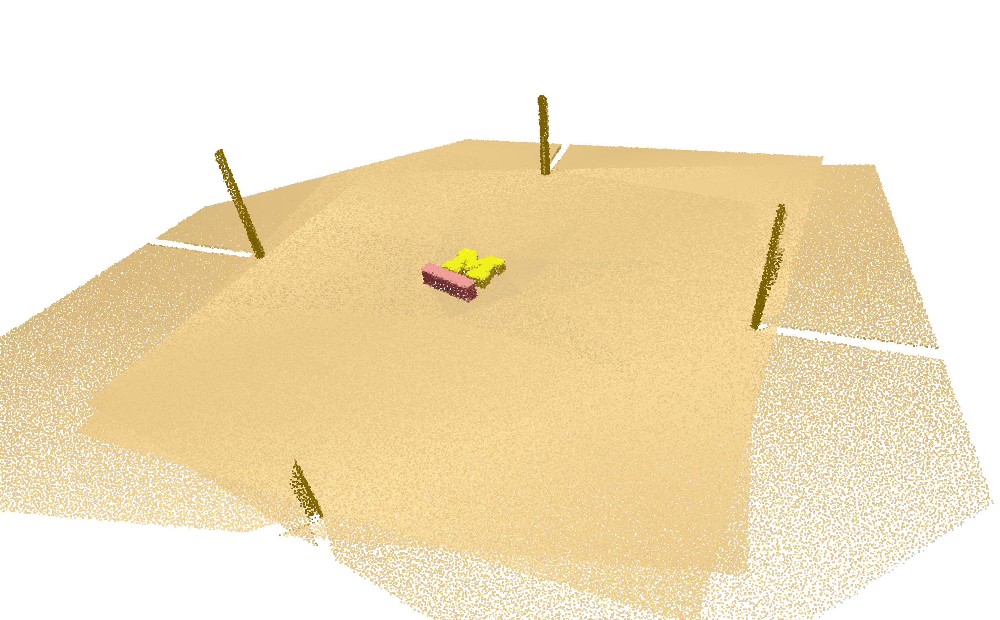
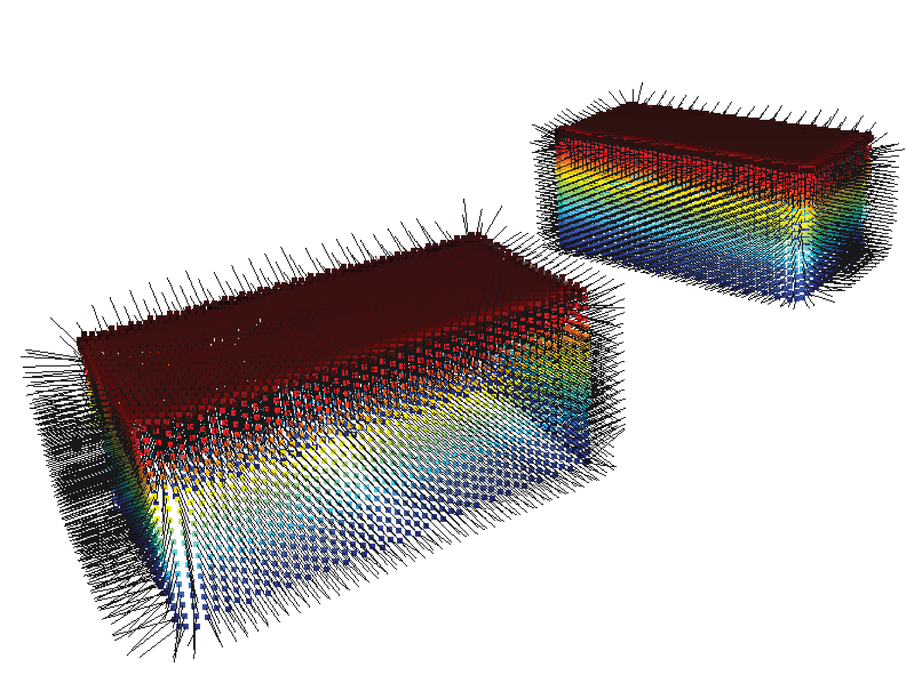
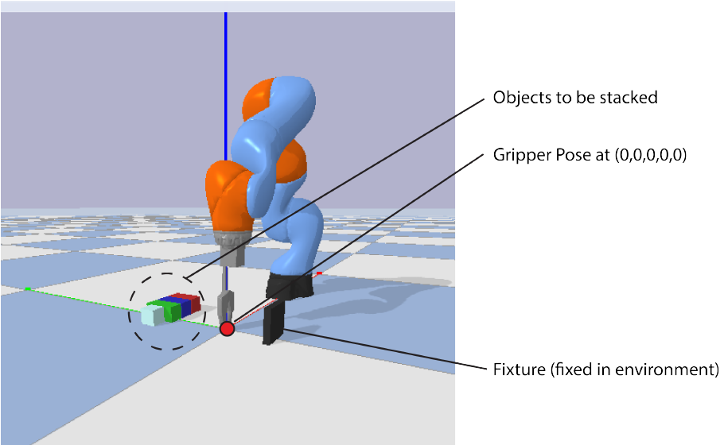

# Introduction to Manipulation
 Python scripts of the assignments in ROB 599 Introduction to Manipulation and Control (Fall 2023)

- ✅ Contact Friction cones and Grasp Wrench Analysis
- ✅ Optimization using Linear complementarity problem
- ✅ Point cloud registration (ICP)
- ✅ Antipodal grasping
- ✅ DMP Controller

## Point cloud registration (ICP)

## Antipodal grasping

